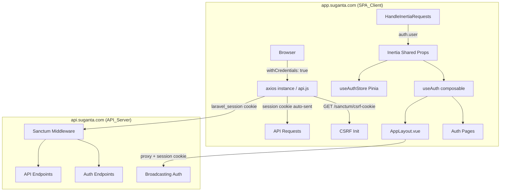

# Design Document: Session Auth Migration

## Overview

This migration replaces the Bearer token / `localStorage` authentication layer in the SuGanta dashboard (`app.suganta.com`) with Laravel Sanctum SPA cookie-based session authentication against `api.suganta.com`.

The current system stores a Sanctum personal access token in `localStorage` under the key `auth_token` and attaches it as `Authorization: Bearer {token}` on every API request. After migration, the browser will carry an encrypted `laravel_session` cookie automatically; no credential will be stored in `localStorage`; and the Inertia `HandleInertiaRequests` middleware will share the authenticated user via `Auth::user()` so the frontend reads identity from Inertia shared props rather than local storage.

### Key Goals

- Eliminate `localStorage` as a credential store (XSS attack surface reduction).
- Establish a single server-authoritative source of truth for the current user via Inertia shared props.
- Preserve all existing auth flows: password login, OTP login, registration, payment gate, logout.
- Preserve all downstream consumers: Echo/Reverb broadcasting, Firebase push tokens, all API composables.

### Research Summary

**Laravel Sanctum SPA Authentication** ([docs](https://laravel.com/docs/sanctum#spa-authentication)) requires:
1. The SPA origin must be listed in `SANCTUM_STATEFUL_DOMAINS` on the API server.
2. The SPA must call `GET /sanctum/csrf-cookie` before any state-mutating request to receive the `XSRF-TOKEN` cookie; axios then automatically sends `X-XSRF-TOKEN` on subsequent requests.
3. All requests must use `withCredentials: true` (cross-origin cookie delivery).
4. For cross-subdomain setups (`app.suganta.com` → `api.suganta.com`), `SESSION_DOMAIN` must be `.suganta.com`, `SESSION_SAME_SITE=none`, and `SESSION_SECURE_COOKIE=true`.

**Inertia.js shared props** are the standard mechanism for passing server-side state to every page. Setting `auth.user` in `HandleInertiaRequests::share()` makes the authenticated user available as `usePage().props.auth.user` on every Vue component without any client-side storage.

**Cross-subdomain cookie constraints**: `SameSite=None; Secure` is required for cookies to be sent on cross-origin requests. This is the correct setting for `app.suganta.com` → `api.suganta.com` communication over HTTPS.

---

## Architecture

The migration follows a layered replacement strategy: infrastructure config → HTTP transport → auth state management → UI pages → downstream consumers.



### Migration Phases

1. **Server config** — API_Server `SANCTUM_STATEFUL_DOMAINS`, `SESSION_DOMAIN`, `SESSION_SAME_SITE`, `SESSION_SECURE_COOKIE`; SPA_Client `config/session.php` and `.env.example`.
2. **HTTP transport** — Refactor `api.js` to remove Bearer injection, add `withCredentials: true`, add CSRF prefetch helper.
3. **Auth state** — Refactor `useAuth` composable and `useAuthStore` to read from Inertia shared props.
4. **Middleware** — Update `HandleInertiaRequests` to share `Auth::user()`.
5. **Auth pages** — Remove `setSession()` calls from Login, VerifyOtp, Register, Payment pages.
6. **Downstream** — Update `BroadcastingAuthProxyController`, `chatEcho.js`, `firebaseWebPush.js`, and API composables.
7. **Cleanup** — Remove `AUTH_TOKEN_KEY`, `AUTH_SESSION_TS_KEY` from `authStorage.js`; purge legacy keys from existing browser sessions.

---

## Components and Interfaces

### 1. `resources/js/api.js` — Axios Instance

**Changes:**
- Set `withCredentials: true` as a default on the axios instance.
- Remove `Authorization: Bearer` header injection from the request interceptor.
- Remove all `localStorage` reads for `AUTH_TOKEN_KEY`, `AUTH_SESSION_TS_KEY`, `AUTH_DEVICE_TOKEN_KEY` from the request interceptor.
- Retain `X-Client-Fingerprint`, `X-Request-Timestamp`, and origin allowlist check.
- Retain `X-Device-Token` header (sourced from a non-sensitive mechanism — a short-lived cookie or removed if the API no longer requires it).
- On 401: dispatch `app:unauthorized` DOM event (no localStorage clearing needed).
- On 403 (outside exempt paths): dispatch `app:unauthorized` DOM event.

**New export — CSRF prefetch helper:**
```js
// Exported helper used by auth pages before state-mutating requests
export async function ensureCsrf() {
    await axios.get(`${SANCTUM_URL}/sanctum/csrf-cookie`, { withCredentials: true });
}
```

Where `SANCTUM_URL` is read from `import.meta.env.VITE_SANCTUM_URL` (defaults to `VITE_API_DOMAIN`).

### 2. `resources/js/composables/useAuth.js` — Auth Composable

**Changes:**
- `getUser()` — reads from `usePage().props.auth.user` instead of `localStorage`.
- `isAuthenticated()` — returns `!!usePage().props.auth.user`.
- `getToken()` — removed or returns `null` unconditionally.
- `setSession()` — removed or no-op.
- `clearSession()` — removes only non-credential `localStorage` keys (`PAYMENT_DETAILS_KEY`, `AUTH_IDENTIFIER_KEY`, `REGISTRATION_CHARGES_KEY`, `POST_VERIFY_LOGIN_NOTICE_KEY`); also calls `localStorage.removeItem('auth_token')` and `localStorage.removeItem('auth_session_ts')` once to purge legacy keys from existing browser sessions.
- `canAccessDashboard()` — evaluates `isRegistrationFeeSatisfied` and `isEmailVerified` against the Inertia props user.
- `enforceBestRoute()` — uses Inertia props user for all routing decisions.
- `refreshToken()` — removed.

**Retained (unchanged):**
- `isEmailVerified()`, `isRegistrationFeeSatisfied()`, `ensureRegistrationPaymentDetails()`, `getBestAuthRoute()`, `getDeviceToken()`, `setRegistrationChargesContext()`, `getRegistrationChargesContext()`.

### 3. `resources/js/stores/auth.js` — Auth Store

**Changes:**
- Remove `token` state property.
- Remove `syncFromStorage()` action (or make it a no-op).
- `isAuthenticated` getter — derives from `usePage().props.auth.user != null`.
- `reset()` — clears only transient state.

**Retained:** `requiresOtp`, `lastPaymentGate`, `setRequiresOtp`, `setLastPaymentGate`, `clearTransient`.

### 4. `app/Http/Middleware/HandleInertiaRequests.php`

**Changes:**
- `share()` sets `auth.user` to `Auth::user()?->only([...safe fields...])` instead of hardcoded `null`.
- Safe fields: `id`, `name`, `first_name`, `last_name`, `email`, `role`, `phone`, `profile_pic`, `email_verified_at`, `registration_fee_status`, `payment_required`, `verification_status`.
- Explicitly excludes: `password`, `remember_token`, any `*_hash` fields.

### 5. Auth Pages

**Login.vue:**
- Before `POST /auth/login`: call `ensureCsrf()`.
- On success: call `router.visit(route('dashboard'))` — no `setSession()`.
- On `requires_otp`: store only `auth_identifier` in `localStorage`, navigate to OTP page.
- Remove all `setSession({ token, user, deviceToken })` calls.

**VerifyOtp.vue:**
- Before `POST /auth/login/verify`: `withCredentials` is handled by the axios instance.
- On success: call `router.visit(route('dashboard'))` — no `setSession()`.
- Remove all `setSession()` calls.

**Register.vue:**
- Before `POST /auth/register`: call `ensureCsrf()`.
- On success: redirect to login — no `setSession()`.

**Payment.vue:**
- `handleLogout()`: POST `/auth/logout` with `withCredentials: true` (handled by axios instance), then `clearSession()`.
- Remove any reads of `AUTH_TOKEN_KEY`.

### 6. `resources/js/Layouts/AppLayout.vue`

**Changes:**
- `user` ref initialized from `usePage().props.auth.user`.
- `onInertiaFinish`: refresh `user.value` from `usePage().props.auth.user`.
- `handleUnauthorized`: call `clearSession()` and redirect to login (no token reads).
- `logout()`: POST `/auth/logout`, call `clearSession()`, redirect to login.
- `connectEcho()`: pass `null` or a no-op instead of `() => getToken()`.
- `syncChatRealtimeSubscriptions()`: remove `getToken()` from `connectEcho()` call.

### 7. `app/Http/Controllers/BroadcastingAuthProxyController.php`

**Changes:**
- Forward the session cookie from the incoming request to the API_Server using `Http::withCookies($request->cookies->all(), ...)`.
- Remove all reads of the `Authorization` header from the incoming request.
- `tryLocalSign()`: use session-authenticated request (cookie forwarding) instead of Bearer token when calling the conversation endpoint.

### 8. `resources/js/services/chatEcho.js`

**Changes:**
- The `authorizer` in `connectEcho()` sends the `/broadcasting/auth` request with `withCredentials: true` and no `Authorization: Bearer` header.
- The `getAccessToken` parameter is removed or ignored.

### 9. `resources/js/services/firebaseWebPush.js` and `pushTokenApi.js`

**No changes needed** — `pushTokenApi.js` already uses the shared axios instance without manual token attachment. `firebaseWebPush.js` does not read `AUTH_TOKEN_KEY`. These are already compliant post-axios-refactor.

### 10. `resources/js/constants/authStorage.js`

**Changes:**
- Remove `AUTH_TOKEN_KEY` and `AUTH_SESSION_TS_KEY` exports after all consumers are updated.
- Retain all other keys.

### 11. `.env.example` and `config/session.php`

**`.env.example` additions:**
```dotenv
# Sanctum SPA auth — URL used for GET /sanctum/csrf-cookie
VITE_SANCTUM_URL=https://api.suganta.com

# --- API_Server must be configured with: ---
# SANCTUM_STATEFUL_DOMAINS=app.suganta.com,localhost,localhost:3000
# SESSION_DOMAIN=.suganta.com
# SESSION_SAME_SITE=none
# SESSION_SECURE_COOKIE=true
```

**`config/session.php`:**
- `same_site` → `env('SESSION_SAME_SITE', 'none')` for production cross-subdomain support.
- `secure` → `env('SESSION_SECURE_COOKIE', true)`.
- `domain` → `env('SESSION_DOMAIN', '.suganta.com')`.

---

## Data Models

### Inertia Shared Props Shape

After migration, every Inertia page receives:

```ts
interface InertiaSharedProps {
  auth: {
    user: AuthUser | null;
  };
  authSlides: AuthSlide[];
  authSlidesVersion: string;
}

interface AuthUser {
  id: number;
  name: string;
  first_name: string;
  last_name: string;
  email: string;
  role: 'student' | 'teacher' | 'institute' | 'ngo' | 'university';
  phone: string | null;
  profile_pic: string | null;
  email_verified_at: string | null;
  registration_fee_status: boolean | 'pending' | 'paid' | 'unpaid' | null;
  payment_required: boolean | null;
  verification_status: string | null;
  // Explicitly excluded: password, remember_token, *_hash fields
}
```

### localStorage Keys After Migration

| Key | Status | Purpose |
|-----|--------|---------|
| `auth_token` | **Removed** (purged on first `clearSession()`) | Legacy Bearer token |
| `auth_session_ts` | **Removed** (purged on first `clearSession()`) | Legacy session timestamp |
| `auth_device_token` | Retained | Trusted device token for OTP bypass |
| `user` | **Removed** | Legacy user object cache |
| `auth_identifier` | Retained | OTP flow identifier (not a credential) |
| `payment_details` | Retained | Payment gate UI state |
| `registration_charges_context` | Retained | Registration fee context |
| `auth_redirect_reason` | Retained | Post-redirect error message |
| `post_verify_login_notice` | Retained | Post-verification notice |

### Session Cookie Flow

```
Browser                    app.suganta.com           api.suganta.com
  |                              |                         |
  |-- GET /login --------------->|                         |
  |<-- Inertia page (auth.user=null) -------------------- |
  |                              |                         |
  |-- [user submits form] ------>|                         |
  |                              |-- GET /sanctum/csrf-cookie -->|
  |                              |<-- Set-Cookie: XSRF-TOKEN ----|
  |                              |-- POST /auth/login ----------->|
  |                              |   (X-XSRF-TOKEN, withCredentials)
  |                              |<-- Set-Cookie: laravel_session |
  |                              |   (success: true)             |
  |-- Inertia visit /dashboard ->|                         |
  |<-- Inertia page (auth.user={...}) -------------------- |
  |   (laravel_session cookie auto-sent on all requests)   |
```

---

## Correctness Properties

*A property is a characteristic or behavior that should hold true across all valid executions of a system — essentially, a formal statement about what the system should do. Properties serve as the bridge between human-readable specifications and machine-verifiable correctness guarantees.*

This feature involves refactoring pure JavaScript functions (axios interceptors, composables, store getters) and a PHP middleware. Property-based testing is applicable to the pure logic layers: the axios interceptor behavior, the `useAuth` composable functions, the `HandleInertiaRequests` middleware output, and the `BroadcastingAuthProxyController` header forwarding.

### Property 1: No Bearer token in outgoing requests

*For any* API request made through the Axios_Instance, the outgoing request headers shall not contain an `Authorization` header with a `Bearer` prefix, regardless of what is stored in `localStorage`.

**Validates: Requirements 3.1, 3.2, 15.2**

---

### Property 2: Required security headers always present

*For any* API request made through the Axios_Instance, the outgoing request headers shall always contain both `X-Client-Fingerprint` and `X-Request-Timestamp`.

**Validates: Requirements 3.4**

---

### Property 3: Origin allowlist blocks untrusted requests

*For any* URL that does not share the same origin as `VITE_API_DOMAIN`, a request to that URL through the Axios_Instance shall be rejected before being sent.

**Validates: Requirements 3.7**

---

### Property 4: CSRF prefetch gates state-mutating requests

*For any* state-mutating auth request (login, register, OTP verify), if the CSRF prefetch (`GET /sanctum/csrf-cookie`) fails, the main request shall not be made and an error shall be surfaced to the user.

**Validates: Requirements 2.1, 2.3**

---

### Property 5: getUser reflects Inertia shared props

*For any* value of `usePage().props.auth.user` (null, a partial user object, or a full user object), `getUser()` shall return exactly that value.

**Validates: Requirements 4.1**

---

### Property 6: isAuthenticated matches user presence

*For any* value of `usePage().props.auth.user`, `isAuthenticated()` shall return `true` if and only if the user is a non-null object.

**Validates: Requirements 4.2, 11.3**

---

### Property 7: clearSession removes only non-credential keys

*For any* `localStorage` state (including states that contain legacy `auth_token` and `auth_session_ts` keys), after `clearSession()` is called, the keys `AUTH_TOKEN_KEY` (`auth_token`) and `AUTH_SESSION_TS_KEY` (`auth_session_ts`) shall be absent, and the keys `PAYMENT_DETAILS_KEY`, `AUTH_IDENTIFIER_KEY`, `REGISTRATION_CHARGES_KEY`, and `POST_VERIFY_LOGIN_NOTICE_KEY` shall also be absent (cleared as non-credential UI state).

**Validates: Requirements 4.5, 15.3**

---

### Property 8: canAccessDashboard is consistent with user state

*For any* user object in Inertia shared props, `canAccessDashboard()` shall return `true` if and only if the user is non-null, `isEmailVerified(user)` is true, and `isRegistrationFeeSatisfied(user)` is true.

**Validates: Requirements 4.6**

---

### Property 9: enforceBestRoute is consistent with user state

*For any* user state in Inertia shared props (null, verified+paid, verified+unpaid, unverified), `enforceBestRoute()` shall return the correct route name: `login` for null, `auth.payment.required` for unpaid, `auth.otp.verify` for unverified, and allow dashboard access for fully verified+paid users.

**Validates: Requirements 4.7, 16.3**

---

### Property 10: HandleInertiaRequests shares user without sensitive fields

*For any* authenticated `Auth::user()` model, the `auth.user` array shared by `HandleInertiaRequests::share()` shall not contain the fields `password`, `remember_token`, or any field ending in `_hash`.

**Validates: Requirements 5.2, 5.3**

---

### Property 11: Broadcasting proxy forwards session cookie, not Bearer token

*For any* incoming request to `BroadcastingAuthProxyController` that carries a session cookie, the upstream request to the API_Server shall include that session cookie and shall not include an `Authorization: Bearer` header.

**Validates: Requirements 12.1, 12.2**

---

### Property 12: Echo authorizer uses withCredentials, no Bearer header

*For any* Pusher channel authorization request made by the Echo authorizer in `chatEcho.js`, the request shall have `withCredentials: true` and shall not include an `Authorization` header.

**Validates: Requirements 12.5**

---

## Error Handling

### CSRF Fetch Failure

If `GET /sanctum/csrf-cookie` fails (network error, 5xx, timeout), the `ensureCsrf()` helper throws. Auth pages catch this and display a user-facing error: *"Unable to establish a secure connection. Please check your network and try again."* The login/register POST is not attempted.

### 401 Unauthorized

The axios response interceptor dispatches `app:unauthorized`. `AppLayout` listens for this event and redirects to the login route. No `localStorage` clearing is needed since there is no token to clear.

### 403 Forbidden

Same as 401 except the exempt paths (`/otp-verify`, `/payment-required`) suppress the redirect to avoid loops during the payment and OTP flows.

### Session Cookie Expiry Between Navigations

When the session expires, the API_Server returns a 401 on the next API call, triggering `app:unauthorized`. For full-page Inertia navigations, the server returns a redirect response which Inertia handles automatically, navigating to the login page.

### Legacy Token in localStorage

On the first call to `clearSession()` after migration, the function calls `localStorage.removeItem('auth_token')` and `localStorage.removeItem('auth_session_ts')` unconditionally. This purges stale tokens from existing browser sessions. The axios interceptor no longer reads these keys, so even if they exist before `clearSession()` runs, they are never used as Bearer tokens.

### Cross-Subdomain Cookie Rejection

If the browser rejects the session cookie (e.g., `SameSite=None` without `Secure` in a non-HTTPS environment), all authenticated API calls will return 401. The error handling above applies. In local development, operators must use HTTPS or configure `SESSION_SAME_SITE=lax` with same-origin proxying.

---

## Testing Strategy

### Unit Tests (Vitest)

Focus on pure logic functions that can be tested in isolation with mocked dependencies.

**`api.js` interceptor tests:**
- Verify `withCredentials: true` is set on the axios instance defaults.
- Verify no `Authorization` header is injected on requests (Property 1).
- Verify `X-Client-Fingerprint` and `X-Request-Timestamp` are always present (Property 2).
- Verify requests to untrusted origins are rejected (Property 3).
- Verify 401 response dispatches `app:unauthorized` event.
- Verify 403 response dispatches `app:unauthorized` on non-exempt paths and does not dispatch on exempt paths.

**`useAuth.js` composable tests:**
- Verify `getUser()` returns `usePage().props.auth.user` for any value (Property 5).
- Verify `isAuthenticated()` matches user presence (Property 6).
- Verify `clearSession()` removes legacy and non-credential keys (Property 7).
- Verify `canAccessDashboard()` logic (Property 8).
- Verify `enforceBestRoute()` routing decisions (Property 9).

**`HandleInertiaRequests` middleware tests (PHPUnit):**
- Verify `auth.user` is `null` for unauthenticated requests.
- Verify `auth.user` contains the correct user fields for authenticated requests.
- Verify sensitive fields are excluded (Property 10).

**`BroadcastingAuthProxyController` tests (PHPUnit):**
- Verify session cookie is forwarded to upstream (Property 11).
- Verify no `Authorization` header is forwarded (Property 11).

### Property-Based Tests

Use [fast-check](https://github.com/dubzzz/fast-check) (JavaScript) and [PHPUnit with data providers](https://phpunit.de/manual/current/en/writing-tests-for-phpunit.html#data-providers) (PHP) for property-based coverage.

**Minimum 100 iterations per property test.**

Tag format: `// Feature: session-auth-migration, Property {N}: {property_text}`

| Property | Test file | Library |
|----------|-----------|---------|
| P1: No Bearer in requests | `tests/js/api.property.test.js` | fast-check |
| P2: Security headers always present | `tests/js/api.property.test.js` | fast-check |
| P3: Origin allowlist | `tests/js/api.property.test.js` | fast-check |
| P4: CSRF gates state-mutating requests | `tests/js/api.property.test.js` | fast-check |
| P5: getUser reflects props | `tests/js/useAuth.property.test.js` | fast-check |
| P6: isAuthenticated matches user presence | `tests/js/useAuth.property.test.js` | fast-check |
| P7: clearSession removes correct keys | `tests/js/useAuth.property.test.js` | fast-check |
| P8: canAccessDashboard consistency | `tests/js/useAuth.property.test.js` | fast-check |
| P9: enforceBestRoute consistency | `tests/js/useAuth.property.test.js` | fast-check |
| P10: Middleware excludes sensitive fields | `tests/Feature/HandleInertiaRequestsTest.php` | PHPUnit data providers |
| P11: Proxy forwards cookie, no Bearer | `tests/Feature/BroadcastingAuthProxyTest.php` | PHPUnit data providers |
| P12: Echo authorizer config | `tests/js/chatEcho.property.test.js` | fast-check |

### Integration Tests

- End-to-end login flow with a real Sanctum session (staging environment).
- Verify session cookie is set after successful login.
- Verify `auth.user` in Inertia props is populated after login.
- Verify 401 redirect to login when session is invalidated.
- Verify broadcasting channel authorization works with session cookie.

### Smoke Tests

- `SANCTUM_STATEFUL_DOMAINS` includes `app.suganta.com`.
- `SESSION_DOMAIN=.suganta.com`, `SESSION_SAME_SITE=none`, `SESSION_SECURE_COOKIE=true` on API_Server.
- `VITE_SANCTUM_URL` is set in `.env`.
- `AUTH_TOKEN_KEY` and `AUTH_SESSION_TS_KEY` are not exported from `authStorage.js`.
- `refreshToken()` is not exported from `useAuth.js`.
