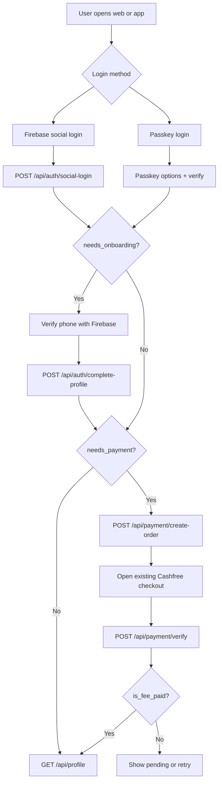

# Social Auth, Passkeys, Onboarding, and Registration Payment

Production implementation guide for Firebase social login, Firebase phone verification, WebAuthn passkeys, role-based registration fees, and Cashfree payment gating.

**Backend base URL:** `https://api.suganta.com/api`  
**Route file:** `routes/social.php`  
**Auth:** Laravel Sanctum Bearer token  
**Payment gateway:** Existing Cashfree flow, unchanged  
**Fee source:** `config/registration.php`

---

## Contents

1. Backend files
2. Environment setup
3. Database setup
4. API response rules
5. API endpoints
6. Web implementation
7. App implementation
8. Passkey implementation details
9. Payment flow
10. Security checklist
11. QA checklist
12. Troubleshooting

---

## 1. Backend Files

| File | Purpose |
|------|---------|
| `routes/social.php` | All social/passkey/onboarding/payment/profile routes |
| `app/Http/Controllers/Api/AuthController.php` | Firebase social login and phone/profile completion |
| `app/Http/Controllers/Api/PasskeyController.php` | WebAuthn register/login options and verification |
| `app/Http/Controllers/Api/PaymentController.php` | API wrapper for registration order creation and verification |
| `app/Http/Controllers/Api/ProfileController.php` | Authenticated profile state endpoint |
| `app/Services/Auth/FirebaseAuthService.php` | Firebase Admin SDK token verification |
| `app/Services/Auth/WebAuthnService.php` | WebAuthn challenge, attestation, assertion verification |
| `app/Services/Auth/RegistrationFeeService.php` | Role fee state, free role handling |
| `app/Services/RedisService.php` | Challenges, rate limits, locks |
| `app/Http/Middleware/CheckProfileComplete.php` | Blocks payment/profile access until onboarding is complete |
| `app/Http/Middleware/CheckPaymentComplete.php` | Blocks final profile access until fee is paid or free |
| `app/Models/Passkey.php` | Registered passkey credentials |
| `config/webauthn.php` | Relying party, origin, and passkey policy |

---

## 2. Environment Setup

### Laravel

```env
APP_URL=https://api.suganta.com
FRONTEND_URL=https://www.suganta.com

SESSION_DOMAIN=.suganta.com
SANCTUM_STATEFUL_DOMAINS=www.suganta.com,app.suganta.com,api.suganta.com,localhost,127.0.0.1
CORS_ALLOWED_ORIGINS=https://www.suganta.com,https://app.suganta.com,http://localhost:3000,http://localhost:5173
```

### Firebase Admin

```env
FIREBASE_PROJECT_ID=suganta-prod
FIREBASE_CREDENTIALS=/absolute/path/to/firebase-service-account.json
```

`FIREBASE_CREDENTIALS` may also be a JSON string, but a server-side file path is preferred in production.

### Redis

```env
CACHE_STORE=redis
REDIS_CLIENT=phpredis
REDIS_HOST=127.0.0.1
REDIS_PORT=6379
REDIS_PASSWORD=null
REDIS_DB=0
REDIS_CACHE_DB=1
```

Redis is used for:

| Use | Key family |
|-----|------------|
| Passkey challenges | `suganta:auth:challenge:*` |
| Rate limits | `suganta:auth:rate:*` |
| Payment locks | `suganta:auth:lock:*` |

### WebAuthn

```env
WEBAUTHN_RP_NAME=SuGanta
WEBAUTHN_RP_ID=api.suganta.com
WEBAUTHN_ALLOWED_ORIGINS=https://api.suganta.com,https://www.suganta.com,https://app.suganta.com
WEBAUTHN_TIMEOUT_SECONDS=60
WEBAUTHN_RESIDENT_KEY=preferred
WEBAUTHN_USER_VERIFICATION=required
WEBAUTHN_ATTESTATION_FORMATS=none
```

Important:

| Setting | Production value |
|---------|------------------|
| `WEBAUTHN_RP_ID` | Domain suffix shared by the client origin and API. Use `suganta.com` if passkeys are created from `www.suganta.com`; use `api.suganta.com` only if WebAuthn runs from that origin. |
| `WEBAUTHN_ALLOWED_ORIGINS` | Exact HTTPS origins that can create/use passkeys |
| `WEBAUTHN_USER_VERIFICATION` | `required` for biometric/PIN-backed login |

### Cashfree

Keep the existing values:

```env
CASHFREE_APP_ID=...
CASHFREE_SECRET_KEY=...
CASHFREE_ENV=production
CASHFREE_API_VERSION=2023-08-01
CASHFREE_RETURN_URL=https://api.suganta.com/api/v1/payment/callback
CASHFREE_WEBHOOK_SECRET=...
```

Do not replace the existing Cashfree checkout, callback, or webhook routes. The new `/api/payment/*` endpoints call the existing registration payment service.

---

## 3. Database Setup

Run:

```bash
composer install
php artisan migrate
php artisan config:clear
php artisan route:clear
```

New/updated tables:

### `users`

| Column | Type | Meaning |
|--------|------|---------|
| `firebase_uid` | string unique nullable | Firebase Auth user UID |
| `provider` | string nullable | Firebase sign-in provider |
| `avatar` | text nullable | Social profile image URL |
| `phone` | string nullable | Verified phone number |
| `role` | string | `student`, `teacher`, `institute`, `university`, etc. |
| `is_phone_verified` | boolean | Phone token was verified by Firebase |
| `is_profile_complete` | boolean | Phone and role are complete |
| `is_fee_paid` | boolean | Registration fee is complete or free |

### `passkeys`

| Column | Type | Meaning |
|--------|------|---------|
| `id` | bigint | Primary key |
| `user_id` | bigint | Owner |
| `credential_id` | string unique | Base64url WebAuthn credential ID |
| `public_key` | text | PEM public key |
| `counter` | unsigned bigint | Signature counter for replay/clone detection |
| `device_name` | string nullable | User/device label |

### `payments`

Existing table remains. The new `payment_id` column stores Cashfree payment ID when available.

---

## 4. API Response Rules

These new routes return direct JSON objects, not the legacy `success/message/code/data` envelope.

### Standard headers

```http
Accept: application/json
Content-Type: application/json
Authorization: Bearer {token}
```

Only public endpoints omit `Authorization`.

### Standard validation error

```json
{
  "message": "The phone field is required.",
  "success": false,
  "code": 422,
  "errors": {
    "phone": [
      "The phone field is required."
    ]
  }
}
```

### Standard auth error

```json
{
  "message": "Unauthenticated.",
  "success": false,
  "code": 401
}
```

### Standard rate limit error

```json
{
  "message": "Too many login attempts."
}
```

---

## 5. API Endpoints

### Endpoint Summary

| Method | Path | Auth | Purpose |
|--------|------|------|---------|
| `POST` | `/api/auth/social-login` | Public | Verify Firebase ID token and return Sanctum token |
| `POST` | `/api/auth/send-otp` | Public | Send SMS OTP for social onboarding phone (only if phone does not already exist) |
| `POST` | `/api/auth/verify-otp` | Public | Verify SMS OTP for social onboarding phone (fails if phone already exists) |
| `POST` | `/api/auth/complete-profile` | Bearer | Complete onboarding with phone + role using either Firebase phone token or SMS OTP |
| `POST` | `/api/auth/passkey/register/options` | Bearer | Create passkey registration challenge |
| `POST` | `/api/auth/passkey/register/verify` | Bearer | Verify attestation and save credential |
| `POST` | `/api/auth/passkey/login/options` | Public | Create passkey login challenge |
| `POST` | `/api/auth/passkey/login/verify` | Public | Verify assertion and return Sanctum token |
| `POST` | `/api/payment/create-order` | Bearer + profile complete | Create/reuse Cashfree registration order |
| `POST` | `/api/payment/verify` | Bearer + profile complete | Verify order status with Cashfree |
| `GET` | `/api/profile` | Bearer + profile complete + payment complete | Get final profile state |

---

## 5.1 Social Login

`POST /api/auth/social-login`

Verifies Firebase ID token, finds or creates a user, and returns a Sanctum token.

### Request

```json
{
  "firebase_token": "eyJhbGciOiJSUzI1NiIsImtpZCI6...",
  "device_name": "Chrome on Windows"
}
```

| Field | Type | Required | Rules |
|-------|------|----------|-------|
| `firebase_token` | string | Yes | Firebase Auth ID token |
| `device_name` | string | No | Max 120 characters |

### Success: profile not complete

```json
{
  "token": "1|xxxxxxxxxxxxxxxxxxxxxxxxxxxxxxxxxxxxxxxx",
  "token_type": "Bearer",
  "needs_onboarding": true,
  "needs_payment": false,
  "user": {
    "id": 101,
    "name": "Amit Sharma",
    "email": "amit@example.com",
    "phone": null,
    "role": "student",
    "avatar": "https://lh3.googleusercontent.com/a/...",
    "is_phone_verified": false,
    "is_profile_complete": false,
    "is_fee_paid": false
  }
}
```

### Success: profile complete, payment required

```json
{
  "token": "1|xxxxxxxxxxxxxxxxxxxxxxxxxxxxxxxxxxxxxxxx",
  "token_type": "Bearer",
  "needs_onboarding": false,
  "needs_payment": true,
  "user": {
    "id": 101,
    "name": "Amit Sharma",
    "email": "amit@example.com",
    "phone": "+919876543210",
    "role": "teacher",
    "avatar": "https://lh3.googleusercontent.com/a/...",
    "is_phone_verified": true,
    "is_profile_complete": true,
    "is_fee_paid": false
  }
}
```

### Success: complete and free/paid

```json
{
  "token": "1|xxxxxxxxxxxxxxxxxxxxxxxxxxxxxxxxxxxxxxxx",
  "token_type": "Bearer",
  "needs_onboarding": false,
  "needs_payment": false,
  "user": {
    "id": 101,
    "name": "Amit Sharma",
    "email": "amit@example.com",
    "phone": "+919876543210",
    "role": "student",
    "avatar": "https://lh3.googleusercontent.com/a/...",
    "is_phone_verified": true,
    "is_profile_complete": true,
    "is_fee_paid": true
  }
}
```

### Errors

| HTTP | Cause |
|------|-------|
| `422` | Missing/invalid token |
| `422` | Firebase user already linked to another SuGanta user |
| `429` | Too many attempts |
| `500` | Firebase Admin credentials misconfigured |

---

## 5.2 Send Social OTP

`POST /api/auth/send-otp`

Public endpoint.

Sends OTP to phone using existing SMS Country implementation.  
If phone already exists in `users.phone`, request is rejected with validation error.

### Request

```json
{
  "phone": "+919876543210"
}
```

| Field | Type | Required | Rules |
|-------|------|----------|-------|
| `phone` | string | Yes | E.164-like phone, 8-15 digits |

### Success

```json
{
  "message": "OTP sent successfully.",
  "phone": "+919876543210"
}
```

### Errors

| HTTP | Cause |
|------|-------|
| `422` | Invalid phone format |
| `422` | Phone already used in system |
| `429` | OTP rate/cooldown limit reached |

---

## 5.3 Verify Social OTP

`POST /api/auth/verify-otp`

Public endpoint.

Verifies OTP for provided phone.  
If phone already exists in `users.phone`, request is rejected with validation error.

### Request

```json
{
  "phone": "+919876543210",
  "otp": "123456"
}
```

| Field | Type | Required | Rules |
|-------|------|----------|-------|
| `phone` | string | Yes | E.164-like phone, 8-15 digits |
| `otp` | string | Yes | 6-digit OTP |

### Success

```json
{
  "message": "OTP verified successfully.",
  "phone": "+919876543210",
  "verified": true
}
```

### Errors

| HTTP | Cause |
|------|-------|
| `422` | Invalid phone or OTP |
| `422` | Invalid/expired OTP |
| `422` | Phone already used in system |

---

## 5.4 Complete Profile

`POST /api/auth/complete-profile`

Requires `Authorization: Bearer {token}`.

Completes onboarding and stores verified phone + role. Amount is read from `config/registration.php`.

You can verify phone using either:

1. `firebase_phone_token` (existing flow), or
2. `otp` (new SMS OTP flow).

### Request (Firebase phone token flow)

```json
{
  "phone": "+919876543210",
  "role": "teacher",
  "firebase_phone_token": "eyJhbGciOiJSUzI1NiIsImtpZCI6..."
}
```

| Field | Type | Required | Rules |
|-------|------|----------|-------|
| `phone` | string | Yes | E.164-like phone, 8-15 digits, unique except current user |
| `role` | string | Yes | Must exist in `registration.charges` |
| `firebase_phone_token` | string | Conditional | Required when `otp` is missing |
| `otp` | string | Conditional | Required when `firebase_phone_token` is missing |

### Request (SMS OTP flow)

```json
{
  "phone": "+919876543210",
  "role": "teacher",
  "otp": "123456"
}
```

### Success: payment required

```json
{
  "needs_payment": true,
  "amount": 299,
  "currency": "INR",
  "user": {
    "id": 101,
    "name": "Amit Sharma",
    "email": "amit@example.com",
    "phone": "+919876543210",
    "role": "teacher",
    "avatar": "https://lh3.googleusercontent.com/a/...",
    "is_phone_verified": true,
    "is_profile_complete": true,
    "is_fee_paid": false
  }
}
```

### Success: free role

```json
{
  "needs_payment": false,
  "amount": 0,
  "currency": "INR",
  "user": {
    "id": 101,
    "name": "Amit Sharma",
    "email": "amit@example.com",
    "phone": "+919876543210",
    "role": "student",
    "avatar": "https://lh3.googleusercontent.com/a/...",
    "is_phone_verified": true,
    "is_profile_complete": true,
    "is_fee_paid": true
  }
}
```

### Errors

| HTTP | Cause |
|------|-------|
| `401` | Missing/invalid Sanctum token |
| `422` | Invalid phone, role, OTP, or Firebase phone token |
| `422` | Phone token belongs to a different Firebase UID |
| `422` | Phone token does not match submitted phone |
| `422` | Invalid or expired OTP |
| `422` | Both `firebase_phone_token` and `otp` missing |

---

## 5.5 Passkey Register Options

`POST /api/auth/passkey/register/options`

Requires `Authorization: Bearer {token}`.

### Request

No body required.

```json
{}
```

### Success

```json
{
  "challenge_id": "22c96f23-66d6-4c61-b388-11f85d012c92",
  "publicKey": {
    "rp": {
      "name": "SuGanta",
      "id": "suganta.com"
    },
    "user": {
      "id": "MTAx",
      "name": "amit@example.com",
      "displayName": "Amit Sharma"
    },
    "authenticatorSelection": {
      "userVerification": "required",
      "residentKey": "preferred",
      "requireResidentKey": false
    },
    "pubKeyCredParams": [
      {
        "type": "public-key",
        "alg": -7
      },
      {
        "type": "public-key",
        "alg": -257
      }
    ],
    "attestation": "none",
    "timeout": 60000,
    "challenge": "0adffKVAa0X3FjJ1b3eSdfwYVv6h4h-QCw6NMi_w2rM",
    "excludeCredentials": []
  }
}
```

| Field | Meaning |
|-------|---------|
| `challenge_id` | Server-side Redis challenge handle. Send it back to verify. |
| `publicKey` | Pass directly to `navigator.credentials.create()` after converting base64url fields to `ArrayBuffer`. |

### Errors

| HTTP | Cause |
|------|-------|
| `401` | Missing/invalid token |
| `429` | Too many registration attempts |

---

## 5.6 Passkey Register Verify

`POST /api/auth/passkey/register/verify`

Requires `Authorization: Bearer {token}`.

### Request

```json
{
  "challenge_id": "22c96f23-66d6-4c61-b388-11f85d012c92",
  "device_name": "Amit Windows Hello",
  "credential": {
    "id": "bnHVF1...",
    "rawId": "bnHVF1...",
    "type": "public-key",
    "response": {
      "clientDataJSON": "eyJ0eXBlIjoid2ViYXV0aG4uY3JlYXRlIiwiY2hhbGxlbmdlIjoi...",
      "attestationObject": "o2NmbXRkbm9uZWdhdHRTdG10oG..."
    }
  }
}
```

| Field | Type | Required | Rules |
|-------|------|----------|-------|
| `challenge_id` | uuid | Yes | Returned by register options |
| `device_name` | string | No | Max 120 characters |
| `credential` | object | Yes | Browser PublicKeyCredential serialized to JSON |
| `credential.id` | string | Yes | Base64url credential id |
| `credential.rawId` | string | Yes | Base64url raw id |
| `credential.response.clientDataJSON` | string | Yes | Base64url |
| `credential.response.attestationObject` | string | Yes | Base64url |

### Success

```json
{
  "passkey_id": 12,
  "device_name": "Amit Windows Hello"
}
```

### Errors

| HTTP | Cause |
|------|-------|
| `401` | Missing/invalid token |
| `422` | Challenge expired or invalid |
| `422` | Attestation signature, origin, RP ID, or credential ID invalid |
| `422` | Duplicate credential ID |

---

## 5.7 Passkey Login Options

`POST /api/auth/passkey/login/options`

Public. Starts passkey login. `identifier` is optional. If provided, server returns allow-list credentials for that user. If omitted, resident/discoverable passkeys are used.

### Request: identifier mode

```json
{
  "identifier": "amit@example.com"
}
```

### Request: discoverable passkey mode

```json
{}
```

| Field | Type | Required | Rules |
|-------|------|----------|-------|
| `identifier` | string | No | Email or phone |

### Success

```json
{
  "challenge_id": "e4c8b3ac-44e6-4a86-8925-4d16861c1aac",
  "publicKey": {
    "timeout": 60000,
    "challenge": "htj4Wq0yRXg6fm2A3Vn5RZgN6hzm8xGQfmhcP9aD5vU",
    "userVerification": "required",
    "rpId": "suganta.com",
    "allowCredentials": [
      {
        "id": "bnHVF1...",
        "transports": ["usb", "nfc", "ble", "hybrid", "internal"],
        "type": "public-key"
      }
    ]
  }
}
```

In discoverable mode `allowCredentials` may be omitted.

### Errors

| HTTP | Cause |
|------|-------|
| `422` | Invalid identifier type |
| `429` | Too many attempts |

---

## 5.8 Passkey Login Verify

`POST /api/auth/passkey/login/verify`

Public.

### Request

```json
{
  "challenge_id": "e4c8b3ac-44e6-4a86-8925-4d16861c1aac",
  "device_name": "Chrome on Windows",
  "credential": {
    "id": "bnHVF1...",
    "rawId": "bnHVF1...",
    "type": "public-key",
    "response": {
      "clientDataJSON": "eyJ0eXBlIjoid2ViYXV0aG4uZ2V0IiwiY2hhbGxlbmdlIjoi...",
      "authenticatorData": "SZYN5YgOjGh0NBcPZHZgW4_krrmihcElc1L...",
      "signature": "MEUCIQDY...",
      "userHandle": "MTAx"
    }
  }
}
```

| Field | Type | Required | Rules |
|-------|------|----------|-------|
| `challenge_id` | uuid | Yes | Returned by login options |
| `device_name` | string | No | Max 120 characters |
| `credential` | object | Yes | Browser PublicKeyCredential serialized to JSON |
| `credential.response.clientDataJSON` | string | Yes | Base64url |
| `credential.response.authenticatorData` | string | Yes | Base64url |
| `credential.response.signature` | string | Yes | Base64url |
| `credential.response.userHandle` | string | No | Base64url user ID for discoverable passkeys |

### Success

```json
{
  "token": "1|xxxxxxxxxxxxxxxxxxxxxxxxxxxxxxxxxxxxxxxx",
  "token_type": "Bearer",
  "needs_onboarding": false,
  "needs_payment": true,
  "user": {
    "id": 101,
    "name": "Amit Sharma",
    "email": "amit@example.com",
    "phone": "+919876543210",
    "role": "teacher"
  }
}
```

### Errors

| HTTP | Cause |
|------|-------|
| `403` | User account inactive |
| `422` | Challenge expired or invalid |
| `422` | Unknown credential |
| `422` | Credential belongs to a different user |
| `422` | Invalid signature, origin, RP ID, user presence, or user verification |
| `422` | Signature counter replay or cloned authenticator detected |
| `429` | Too many login attempts |

---

## 5.9 Create Registration Payment Order

`POST /api/payment/create-order`

Requires:

```http
Authorization: Bearer {token}
```

Middleware:

| Middleware | Requirement |
|------------|-------------|
| `auth:sanctum` | Valid token |
| `profile.complete` | Phone verified, role selected |

Uses:

```php
$charges = config("registration.charges.$user->role");
$amount = $charges['discounted_price'];
```

### Request

No body required.

```json
{}
```

### Success: paid/free already complete

```json
{
  "already_paid": true,
  "needs_payment": false,
  "amount": 0,
  "currency": "INR"
}
```

### Success: Cashfree order created or reused

```json
{
  "order_id": "REG_8M1K2Q9PZA",
  "checkout_url": "https://payments.cashfree.com/order/#/session_id",
  "payment_session_id": "session_id",
  "amount": 299,
  "currency": "INR",
  "needs_payment": true,
  "already_paid": false
}
```

### Errors

| HTTP | Cause |
|------|-------|
| `401` | Missing/invalid token |
| `403` | Profile is not complete |
| `409` | Duplicate payment create request locked |
| `422` | Payment system unavailable or role charge missing |
| `429` | Too many payment attempts |

---

## 5.10 Verify Registration Payment

`POST /api/payment/verify`

Requires:

```http
Authorization: Bearer {token}
```

### Request

```json
{
  "order_id": "REG_8M1K2Q9PZA"
}
```

| Field | Type | Required | Rules |
|-------|------|----------|-------|
| `order_id` | string | Yes | Max 120 characters; must belong to authenticated user |

### Success: paid

```json
{
  "order_id": "REG_8M1K2Q9PZA",
  "status": "success",
  "is_fee_paid": true
}
```

### Success: still pending

```json
{
  "order_id": "REG_8M1K2Q9PZA",
  "status": "active",
  "is_fee_paid": false
}
```

### Errors

| HTTP | Cause |
|------|-------|
| `401` | Missing/invalid token |
| `403` | Profile incomplete |
| `404` | Order not found or does not belong to user |
| `409` | Duplicate verify request locked |
| `422` | Missing order ID |

---

## 5.11 Final Profile

`GET /api/profile`

Requires:

| Middleware | Requirement |
|------------|-------------|
| `auth:sanctum` | Valid token |
| `profile.complete` | Phone and role done |
| `payment.complete` | Fee paid or free role |

### Success

```json
{
  "user": {
    "id": 101,
    "name": "Amit Sharma",
    "email": "amit@example.com",
    "phone": "+919876543210",
    "role": "teacher",
    "avatar": "https://lh3.googleusercontent.com/a/...",
    "is_phone_verified": true,
    "is_profile_complete": true,
    "is_fee_paid": true
  },
  "needs_onboarding": false,
  "needs_payment": false
}
```

### Error: payment required

```json
{
  "message": "Registration payment is required.",
  "needs_onboarding": false,
  "needs_payment": true,
  "amount": 299,
  "currency": "INR"
}
```

### Error: profile incomplete

```json
{
  "message": "Complete phone verification and role selection first.",
  "needs_onboarding": true,
  "needs_payment": false
}
```

---

## 6. Web Implementation

### Web dependencies

Use Firebase Web SDK and browser WebAuthn APIs.

```bash
npm install firebase
```

### API client

```ts
const API_BASE_URL = 'https://api.suganta.com/api';

export async function apiFetch(path: string, options: RequestInit = {}) {
  const token = localStorage.getItem('access_token');

  const headers = new Headers(options.headers);
  headers.set('Accept', 'application/json');
  headers.set('Content-Type', 'application/json');

  if (token) {
    headers.set('Authorization', `Bearer ${token}`);
  }

  const response = await fetch(`${API_BASE_URL}${path}`, {
    ...options,
    headers,
    credentials: 'include',
  });

  const data = await response.json().catch(() => ({}));

  if (!response.ok) {
    throw Object.assign(new Error(data.message || 'API request failed'), {
      status: response.status,
      data,
    });
  }

  return data;
}
```

### Firebase initialization

```ts
import { initializeApp } from 'firebase/app';
import {
  getAuth,
  GoogleAuthProvider,
  FacebookAuthProvider,
  signInWithPopup,
  RecaptchaVerifier,
  signInWithPhoneNumber,
} from 'firebase/auth';

const firebaseApp = initializeApp({
  apiKey: import.meta.env.VITE_FIREBASE_API_KEY,
  authDomain: import.meta.env.VITE_FIREBASE_AUTH_DOMAIN,
  projectId: import.meta.env.VITE_FIREBASE_PROJECT_ID,
  appId: import.meta.env.VITE_FIREBASE_APP_ID,
});

export const firebaseAuth = getAuth(firebaseApp);
export const googleProvider = new GoogleAuthProvider();
export const facebookProvider = new FacebookAuthProvider();
```

### Social login flow

```ts
export async function loginWithGoogle() {
  const credential = await signInWithPopup(firebaseAuth, googleProvider);
  const firebaseToken = await credential.user.getIdToken(true);

  const response = await apiFetch('/auth/social-login', {
    method: 'POST',
    body: JSON.stringify({
      firebase_token: firebaseToken,
      device_name: navigator.userAgent,
    }),
  });

  localStorage.setItem('access_token', response.token);

  return routeAfterAuth(response);
}

function routeAfterAuth(response: {
  needs_onboarding: boolean;
  needs_payment: boolean;
}) {
  if (response.needs_onboarding) return '/onboarding';
  if (response.needs_payment) return '/payment';
  return '/dashboard';
}
```

### Phone verification and role onboarding

```ts
let confirmationResult: import('firebase/auth').ConfirmationResult;

export function mountRecaptcha(containerId = 'recaptcha-container') {
  return new RecaptchaVerifier(firebaseAuth, containerId, {
    size: 'invisible',
  });
}

export async function sendPhoneOtp(phone: string) {
  const verifier = mountRecaptcha();
  confirmationResult = await signInWithPhoneNumber(firebaseAuth, phone, verifier);
}

export async function completeProfile(phone: string, role: string, otp: string) {
  const credential = await confirmationResult.confirm(otp);
  const phoneToken = await credential.user.getIdToken(true);

  const response = await apiFetch('/auth/complete-profile', {
    method: 'POST',
    body: JSON.stringify({
      phone,
      role,
      firebase_phone_token: phoneToken,
    }),
  });

  if (response.needs_payment) return '/payment';
  return '/dashboard';
}
```

### Create payment order

```ts
export async function createRegistrationOrder() {
  const response = await apiFetch('/payment/create-order', {
    method: 'POST',
    body: JSON.stringify({}),
  });

  if (response.already_paid) {
    return { done: true };
  }

  return {
    done: false,
    orderId: response.order_id,
    checkoutUrl: response.checkout_url,
    paymentSessionId: response.payment_session_id,
    amount: response.amount,
    currency: response.currency,
  };
}
```

### Open Cashfree checkout

The existing backend returns a Cashfree checkout URL/session. Preferred web behavior is to redirect to the existing backend checkout proxy when possible:

```ts
export function openRegistrationPayment(orderId: string) {
  window.location.href = `https://api.suganta.com/api/v1/payment/checkout?order_id=${encodeURIComponent(orderId)}`;
}
```

After Cashfree returns, poll:

```ts
export async function verifyRegistrationPayment(orderId: string) {
  const response = await apiFetch('/payment/verify', {
    method: 'POST',
    body: JSON.stringify({ order_id: orderId }),
  });

  if (response.is_fee_paid) return '/dashboard';
  return '/payment-pending';
}
```

---

## 7. App Implementation

This section is for Flutter. The same flow applies to native Android/iOS.

### Flutter dependencies

```yaml
dependencies:
  dio: any
  firebase_core: any
  firebase_auth: any
  google_sign_in: any
  flutter_secure_storage: any
  url_launcher: any
```

For Apple login, add your selected Apple sign-in package and configure Apple provider in Firebase Console.

### API client

```dart
import 'package:dio/dio.dart';
import 'package:flutter_secure_storage/flutter_secure_storage.dart';

class SugantaApi {
  SugantaApi()
      : dio = Dio(BaseOptions(
          baseUrl: 'https://api.suganta.com/api',
          headers: {
            'Accept': 'application/json',
            'Content-Type': 'application/json',
          },
        ));

  final Dio dio;
  final FlutterSecureStorage storage = const FlutterSecureStorage();

  Future<void> setToken(String token) async {
    await storage.write(key: 'access_token', value: token);
    dio.options.headers['Authorization'] = 'Bearer $token';
  }

  Future<void> loadToken() async {
    final token = await storage.read(key: 'access_token');
    if (token != null && token.isNotEmpty) {
      dio.options.headers['Authorization'] = 'Bearer $token';
    }
  }
}
```

### Firebase app init

```dart
import 'package:firebase_core/firebase_core.dart';

Future<void> initFirebase() async {
  await Firebase.initializeApp();
}
```

Call before `runApp(...)`.

### Google login

```dart
import 'package:firebase_auth/firebase_auth.dart';
import 'package:google_sign_in/google_sign_in.dart';

class SocialAuthRepository {
  SocialAuthRepository(this.api);

  final SugantaApi api;

  Future<Map<String, dynamic>> signInWithGoogle() async {
    final googleUser = await GoogleSignIn().signIn();
    if (googleUser == null) {
      throw Exception('Google login cancelled');
    }

    final googleAuth = await googleUser.authentication;
    final credential = GoogleAuthProvider.credential(
      accessToken: googleAuth.accessToken,
      idToken: googleAuth.idToken,
    );

    final userCredential =
        await FirebaseAuth.instance.signInWithCredential(credential);

    final firebaseToken = await userCredential.user!.getIdToken(true);

    final response = await api.dio.post('/auth/social-login', data: {
      'firebase_token': firebaseToken,
      'device_name': 'Flutter App',
    });

    final data = Map<String, dynamic>.from(response.data);
    await api.setToken(data['token'] as String);
    return data;
  }
}
```

### Phone verification and profile completion

```dart
import 'package:firebase_auth/firebase_auth.dart';

class PhoneOnboardingRepository {
  PhoneOnboardingRepository(this.api);

  final SugantaApi api;
  String? verificationId;

  Future<void> sendOtp(String phone) async {
    await FirebaseAuth.instance.verifyPhoneNumber(
      phoneNumber: phone,
      verificationCompleted: (_) {},
      verificationFailed: (FirebaseAuthException e) {
        throw Exception(e.message ?? 'Phone verification failed');
      },
      codeSent: (String id, int? resendToken) {
        verificationId = id;
      },
      codeAutoRetrievalTimeout: (String id) {
        verificationId = id;
      },
    );
  }

  Future<Map<String, dynamic>> completeProfile({
    required String phone,
    required String role,
    required String smsCode,
  }) async {
    final credential = PhoneAuthProvider.credential(
      verificationId: verificationId!,
      smsCode: smsCode,
    );

    final userCredential =
        await FirebaseAuth.instance.signInWithCredential(credential);

    final phoneToken = await userCredential.user!.getIdToken(true);

    final response = await api.dio.post('/auth/complete-profile', data: {
      'phone': phone,
      'role': role,
      'firebase_phone_token': phoneToken,
    });

    return Map<String, dynamic>.from(response.data);
  }
}
```

### Payment in Flutter

```dart
import 'package:url_launcher/url_launcher.dart';

class RegistrationPaymentRepository {
  RegistrationPaymentRepository(this.api);

  final SugantaApi api;

  Future<Map<String, dynamic>> createOrder() async {
    final response = await api.dio.post('/payment/create-order', data: {});
    return Map<String, dynamic>.from(response.data);
  }

  Future<void> openCheckout(String orderId) async {
    final uri = Uri.parse(
      'https://api.suganta.com/api/v1/payment/checkout?order_id=$orderId',
    );

    if (!await launchUrl(uri, mode: LaunchMode.externalApplication)) {
      throw Exception('Unable to open payment checkout');
    }
  }

  Future<Map<String, dynamic>> verify(String orderId) async {
    final response = await api.dio.post('/payment/verify', data: {
      'order_id': orderId,
    });

    return Map<String, dynamic>.from(response.data);
  }
}
```

### App navigation decision

```dart
String nextRoute(Map<String, dynamic> response) {
  if (response['needs_onboarding'] == true) return '/onboarding';
  if (response['needs_payment'] == true) return '/registration-payment';
  return '/dashboard';
}
```

---

## 8. Passkey Implementation Details

### Base64url helpers for web

```ts
export function base64UrlToArrayBuffer(value: string): ArrayBuffer {
  const base64 = value.replace(/-/g, '+').replace(/_/g, '/');
  const padded = base64.padEnd(base64.length + ((4 - base64.length % 4) % 4), '=');
  const binary = atob(padded);
  const bytes = new Uint8Array(binary.length);

  for (let i = 0; i < binary.length; i += 1) {
    bytes[i] = binary.charCodeAt(i);
  }

  return bytes.buffer;
}

export function arrayBufferToBase64Url(buffer: ArrayBuffer): string {
  const bytes = new Uint8Array(buffer);
  let binary = '';

  for (const byte of bytes) {
    binary += String.fromCharCode(byte);
  }

  return btoa(binary).replace(/\+/g, '-').replace(/\//g, '_').replace(/=+$/g, '');
}
```

### Prepare create options

```ts
function prepareCreateOptions(publicKey: any): PublicKeyCredentialCreationOptions {
  return {
    ...publicKey,
    challenge: base64UrlToArrayBuffer(publicKey.challenge),
    user: {
      ...publicKey.user,
      id: base64UrlToArrayBuffer(publicKey.user.id),
    },
    excludeCredentials: (publicKey.excludeCredentials || []).map((item: any) => ({
      ...item,
      id: base64UrlToArrayBuffer(item.id),
    })),
  };
}
```

### Prepare get options

```ts
function prepareGetOptions(publicKey: any): PublicKeyCredentialRequestOptions {
  return {
    ...publicKey,
    challenge: base64UrlToArrayBuffer(publicKey.challenge),
    allowCredentials: publicKey.allowCredentials?.map((item: any) => ({
      ...item,
      id: base64UrlToArrayBuffer(item.id),
    })),
  };
}
```

### Register passkey on web

```ts
export async function registerPasskey(deviceName: string) {
  const optionsResponse = await apiFetch('/auth/passkey/register/options', {
    method: 'POST',
    body: JSON.stringify({}),
  });

  const credential = await navigator.credentials.create({
    publicKey: prepareCreateOptions(optionsResponse.publicKey),
  }) as PublicKeyCredential;

  const response = credential.response as AuthenticatorAttestationResponse;

  return apiFetch('/auth/passkey/register/verify', {
    method: 'POST',
    body: JSON.stringify({
      challenge_id: optionsResponse.challenge_id,
      device_name: deviceName,
      credential: {
        id: credential.id,
        rawId: arrayBufferToBase64Url(credential.rawId),
        type: credential.type,
        response: {
          clientDataJSON: arrayBufferToBase64Url(response.clientDataJSON),
          attestationObject: arrayBufferToBase64Url(response.attestationObject),
        },
      },
    }),
  });
}
```

### Login with passkey on web

```ts
export async function loginWithPasskey(identifier?: string) {
  const optionsResponse = await apiFetch('/auth/passkey/login/options', {
    method: 'POST',
    body: JSON.stringify(identifier ? { identifier } : {}),
  });

  const credential = await navigator.credentials.get({
    publicKey: prepareGetOptions(optionsResponse.publicKey),
  }) as PublicKeyCredential;

  const response = credential.response as AuthenticatorAssertionResponse;

  const loginResponse = await apiFetch('/auth/passkey/login/verify', {
    method: 'POST',
    body: JSON.stringify({
      challenge_id: optionsResponse.challenge_id,
      device_name: navigator.userAgent,
      credential: {
        id: credential.id,
        rawId: arrayBufferToBase64Url(credential.rawId),
        type: credential.type,
        response: {
          clientDataJSON: arrayBufferToBase64Url(response.clientDataJSON),
          authenticatorData: arrayBufferToBase64Url(response.authenticatorData),
          signature: arrayBufferToBase64Url(response.signature),
          userHandle: response.userHandle
            ? arrayBufferToBase64Url(response.userHandle)
            : null,
        },
      },
    }),
  });

  localStorage.setItem('access_token', loginResponse.token);
  return routeAfterAuth(loginResponse);
}
```

### Passkeys in Flutter apps

Use the platform passkey stack:

| Platform | Native API |
|----------|------------|
| Android | Credential Manager |
| iOS | AuthenticationServices / passkeys |
| Web build | Browser WebAuthn |

The mobile passkey plugin must:

1. Request registration options from `/api/auth/passkey/register/options`.
2. Convert challenge/user/credential IDs from base64url into platform binary types.
3. Create a passkey with the platform API.
4. Serialize `clientDataJSON`, `attestationObject`, `authenticatorData`, `signature`, and `userHandle` as base64url.
5. Send the same JSON shape documented above.

Do not invent a custom passkey protocol in Flutter. Use the OS credential/passkey APIs and keep the backend JSON contract identical.

---

## 9. Final End-to-End Flow



---

## 10. Role Fee Behavior

Source:

```php
config('registration.charges')
```

Current examples:

| Role | Amount |
|------|--------|
| `student` | `0` |
| `teacher` | `299` |
| `institute` | `599` |
| `university` | `699` |

Rules:

1. Backend never trusts amount from frontend.
2. Frontend sends only role, never amount.
3. If discounted price is `0`, backend sets `is_fee_paid = true`.
4. If discounted price is greater than `0`, user must complete Cashfree payment.
5. On Cashfree success, backend sets:

```php
is_fee_paid = true
registration_fee_status = paid
verification_status = verified
is_active = true
```

---

## 11. Security Checklist

### Backend

| Control | Implemented |
|---------|-------------|
| Firebase ID token verification | Yes |
| Firebase phone token verification | Yes |
| Phone token UID/phone match | Yes |
| Sanctum token auth | Yes |
| Redis challenge TTL | Yes |
| Redis rate limiting | Yes |
| Redis payment locks | Yes |
| WebAuthn origin check | Yes |
| WebAuthn RP ID hash check | Yes |
| WebAuthn signature verification | Yes |
| WebAuthn signature counter replay detection | Yes |
| Role fee from config only | Yes |
| Cashfree order verification server-side | Yes |

### Client

| Rule | Required behavior |
|------|-------------------|
| Store Sanctum token securely | Web: memory/localStorage depending risk; App: secure storage |
| Never send fee amount | Backend calculates amount |
| Never trust UI route state | Always follow API `needs_onboarding` and `needs_payment` |
| Passkey binary fields | Convert ArrayBuffer to base64url |
| Payment success | Always call `/api/payment/verify` |
| Logout | Delete local token and Firebase session if needed |

---

## 12. QA Checklist

### Backend

```bash
php -l routes/social.php
php artisan route:list --path=auth
php artisan route:list --path=payment
php artisan route:list --path=profile
php artisan migrate --pretend --path=database/migrations/2026_05_04_000000_add_firebase_auth_fields_to_users_table.php
php artisan migrate --pretend --path=database/migrations/2026_05_04_000001_create_passkeys_table.php
php artisan migrate --pretend --path=database/migrations/2026_05_04_000002_add_payment_id_to_payments_table.php
```

### Web

| Test | Expected |
|------|----------|
| Google login with new user | Returns token and `needs_onboarding=true` |
| Phone OTP valid | `/complete-profile` sets phone verified |
| Student role | `needs_payment=false`, dashboard allowed |
| Teacher role | `needs_payment=true`, payment page shown |
| Register passkey | Passkey saved in `passkeys` |
| Login with passkey | Returns token |
| Reuse old passkey assertion | Rejected by counter/challenge |
| Wrong origin | Rejected |

### App

| Test | Expected |
|------|----------|
| Firebase Google/Apple credential | Backend accepts ID token |
| Phone verification credential | Backend accepts phone token only for matching phone |
| Secure token storage | Token restored on app restart |
| Payment external browser | Cashfree checkout opens |
| Payment verify | Marks fee paid after Cashfree success |

---

## 13. Troubleshooting

### Firebase token invalid

Check:

1. `FIREBASE_PROJECT_ID`
2. `FIREBASE_CREDENTIALS`
3. Client app uses same Firebase project.
4. Token is ID token, not access token.

### Phone token mismatch

Cause:

| Problem | Fix |
|---------|-----|
| User typed phone differently | Normalize to E.164 before sending |
| Token is from social login, not phone auth | Use Firebase phone verification token |
| Token belongs to another Firebase UID | Re-authenticate or link phone correctly |

### Passkey origin invalid

Check:

1. `WEBAUTHN_RP_ID`
2. `WEBAUTHN_ALLOWED_ORIGINS`
3. Page is loaded over HTTPS.
4. Browser origin is same domain or valid suffix of RP ID.

Example:

| Web page origin | Valid RP ID |
|-----------------|-------------|
| `https://www.suganta.com` | `suganta.com` |
| `https://app.suganta.com` | `suganta.com` |
| `https://api.suganta.com` | `suganta.com` or `api.suganta.com` |

### Payment already in progress

HTTP `409` means Redis lock is active. Disable duplicate button taps and retry after a few seconds.

### Payment says pending after success

Check:

1. Cashfree order ID belongs to authenticated user.
2. Cashfree webhook secret is valid.
3. Call `/api/payment/verify` after returning from checkout.
4. Check `storage/logs/laravel.log` and payment channel logs.

### Profile route returns 402

The user is authenticated and profile is complete, but payment is still required. Call `/api/payment/create-order`.

### Profile route returns 403

Phone and role onboarding is incomplete. Call `/api/auth/complete-profile`.

---

## 14. Production Deployment Steps

1. Deploy code.
2. Run `composer install --no-dev --optimize-autoloader`.
3. Set Firebase, Redis, WebAuthn, Cashfree env values.
4. Run `php artisan migrate --force`.
5. Run:

```bash
php artisan config:clear
php artisan route:clear
php artisan cache:clear
php artisan config:cache
php artisan route:cache
```

6. Confirm routes:

```bash
php artisan route:list --path=auth
php artisan route:list --path=payment
```

7. Test full flow on staging:
   - social login
   - phone verification
   - free role
   - paid role
   - Cashfree success
   - passkey registration
   - passkey login

8. Monitor:
   - Laravel logs
   - Redis connectivity
   - Cashfree webhook delivery
   - Firebase token verification errors
   - WebAuthn origin/counter errors

